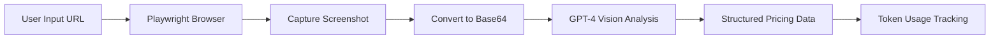

# Web Pricing Extraction Agent - Implementation Plan

## Overview
Transform the OpenAI Agents SDK proof of concept to extract and analyze pricing models from websites using visual analysis with Playwright screenshots and GPT-4 Vision capabilities.

## Architecture Overview



## Implementation Details

### 1. Dependencies

```json
{
  "dependencies": {
    "@openai/agents": "^0.0.1",
    "playwright": "^1.48.0",
    "zod": "^3.23.8"
  }
}
```

### 2. Core Tool Implementation

#### Screenshot Capture Tool

```typescript
const captureAndAnalyzePricingTool = tool({
  name: 'capture_analyze_pricing',
  description: 'Capture screenshot of webpage and analyze pricing visually',
  parameters: {
    type: 'object',
    properties: {
      url: {
        type: 'string',
        description: 'The URL of the pricing page to analyze'
      }
    },
    required: ['url']
  },
  execute: async (args) => {
    // Implementation details below
  }
});
```

### 3. Playwright Integration

```typescript
import { chromium } from 'playwright';

async function captureScreenshot(url: string): Promise<string> {
  const browser = await chromium.launch({ headless: true });
  const page = await browser.newPage();
  
  // Set viewport for consistent captures
  await page.setViewportSize({ width: 1920, height: 1080 });
  
  // Navigate and wait for network idle
  await page.goto(url, { waitUntil: 'networkidle' });
  
  // Auto-scroll to capture lazy-loaded content
  await autoScroll(page);
  
  // Take full-page screenshot
  const screenshot = await page.screenshot({ 
    fullPage: true,
    type: 'png' 
  });
  
  await browser.close();
  
  // Convert to base64
  return screenshot.toString('base64');
}
```

### 4. Auto-Scroll Function

```typescript
async function autoScroll(page: Page): Promise<void> {
  await page.evaluate(async () => {
    await new Promise<void>((resolve) => {
      let totalHeight = 0;
      const distance = 100;
      const timer = setInterval(() => {
        const scrollHeight = document.body.scrollHeight;
        window.scrollBy(0, distance);
        totalHeight += distance;
        
        if(totalHeight >= scrollHeight){
          clearInterval(timer);
          resolve();
        }
      }, 100);
    });
  });
}
```

### 5. Agent Configuration

```typescript
const pricingAnalyzerAgent = new Agent({
  name: 'Visual Pricing Analyzer',
  instructions: `You are an expert at analyzing pricing pages visually. 
    When given a screenshot of a pricing page:
    1. Identify all pricing tiers/plans
    2. Extract the price for each tier
    3. Note the billing period (monthly/yearly)
    4. List key features for each tier
    5. Identify any special offers or discounts
    6. Return structured JSON with all pricing information
    
    Focus on:
    - Price amounts and currency symbols
    - Plan names (Free, Basic, Pro, Enterprise, etc.)
    - Billing frequencies
    - Feature lists
    - Call-to-action buttons
    - Any pricing tables or cards`,
  model: 'gpt-4o', // Use vision-capable model
  tools: [captureAndAnalyzePricingTool]
});
```

### 6. Enhanced Tool Execute Function

```typescript
execute: async (args) => {
  console.log(`🔧 Capturing screenshot from: ${args.url}`);
  
  try {
    const browser = await chromium.launch({ headless: true });
    const page = await browser.newPage();
    
    await page.setViewportSize({ width: 1920, height: 1080 });
    await page.goto(args.url, { waitUntil: 'networkidle' });
    
    // Auto-scroll to load dynamic content
    await autoScroll(page);
    
    const screenshot = await page.screenshot({ 
      fullPage: true,
      type: 'png' 
    });
    
    await browser.close();
    
    const base64Image = screenshot.toString('base64');
    console.log(`✅ Screenshot captured (${screenshot.length} bytes)`);
    
    // Return formatted for vision analysis
    return {
      type: 'image',
      image_url: {
        url: `data:image/png;base64,${base64Image}`
      },
      detail: 'high'
    };
  } catch (error) {
    console.error(`❌ Screenshot capture failed: ${error}`);
    throw error;
  }
}
```

### 7. Output Data Structure

```typescript
interface ExtractedPricing {
  url: string;
  extractionMethod: 'screenshot';
  timestamp: string;
  pricingTiers: Array<{
    tierName: string;
    price: {
      amount: number;
      currency: string;
      period: 'monthly' | 'yearly' | 'one-time';
    };
    features: string[];
    highlighted: boolean;
    ctaText?: string;
  }>;
  specialOffers?: string[];
  notes?: string;
}
```

### 8. Main Function

```typescript
async function main(): Promise<void> {
  try {
    console.log('Starting agent execution...\n');
    
    // Example: Analyze Tailscale pricing
    const userInput = 'Please analyze the pricing at https://tailscale.com/pricing';
    console.log(`📝 User Input: "${userInput}"\n`);
    
    console.log('🔄 Agent is processing...\n');
    const result = await run(pricingAnalyzerAgent, userInput);
    
    // Parse structured pricing from response
    try {
      const pricingData = JSON.parse(result.finalOutput);
      console.log('💰 Pricing Analysis:');
      console.log(JSON.stringify(pricingData, null, 2));
    } catch {
      console.log('📊 Analysis:', result.finalOutput);
    }
    
    // Token usage tracking (existing implementation)
    if (result.rawResponses && result.rawResponses.length > 0) {
      const usageData = extractUsageFromRawResponses(result.rawResponses, 'gpt-4o');
      console.log(`📊 Total Tokens Used: ${usageData.totalTokens}`);
    }
    
  } catch (error) {
    console.error('❌ Error:', error);
  }
}
```

## Implementation Steps

1. **Install Playwright**
   ```bash
   npm install playwright
   npx playwright install chromium
   ```

2. **Update package.json**
   - Add playwright dependency
   - Keep existing scripts

3. **Replace Existing Tool**
   - Remove `fetchUrlTool`
   - Add `captureAndAnalyzePricingTool`

4. **Update Agent Configuration**
   - Change to vision-capable model (gpt-4o)
   - Update instructions for visual analysis

5. **Implement Screenshot Logic**
   - Browser automation
   - Auto-scrolling
   - Base64 encoding

6. **Test Implementation**
   ```bash
   npm start
   ```

## Example Usage

### Input
```typescript
const userInput = 'Analyze the pricing model at https://tailscale.com/pricing';
```

### Expected Output
```json
{
  "url": "https://tailscale.com/pricing",
  "extractionMethod": "screenshot",
  "timestamp": "2024-08-23T10:30:00Z",
  "pricingTiers": [
    {
      "tierName": "Personal",
      "price": {
        "amount": 0,
        "currency": "USD",
        "period": "monthly"
      },
      "features": [
        "Up to 3 users",
        "Up to 20 devices",
        "Community support"
      ],
      "highlighted": false,
      "ctaText": "Get Started"
    },
    {
      "tierName": "Team",
      "price": {
        "amount": 6,
        "currency": "USD",
        "period": "monthly"
      },
      "features": [
        "Unlimited users",
        "Unlimited devices",
        "Email support",
        "Access controls"
      ],
      "highlighted": true,
      "ctaText": "Start Free Trial"
    },
    {
      "tierName": "Enterprise",
      "price": {
        "amount": null,
        "currency": "USD",
        "period": "custom"
      },
      "features": [
        "Custom pricing",
        "Advanced security",
        "Dedicated support",
        "SLA"
      ],
      "highlighted": false,
      "ctaText": "Contact Sales"
    }
  ],
  "specialOffers": [
    "20% discount on annual billing"
  ],
  "notes": "Pricing extracted from visual analysis of pricing page screenshot"
}
```

## Key Benefits

1. **Handles Dynamic Content**: Works with JavaScript-rendered pricing pages
2. **Visual Understanding**: Captures layout, emphasis, and design cues
3. **Complete Information**: Gets all visible pricing elements including visual hierarchy
4. **No HTML Parsing Required**: Bypasses complex DOM structures
5. **Human-like Analysis**: Understands pricing the way users see it

## Token Usage Considerations

- **Vision models use more tokens** than text-only models
- **Screenshot size affects token usage** - full-page screenshots use more tokens
- **Structured output requests** may require additional tokens
- **Consider caching** screenshots for repeated analysis

## Potential Enhancements

1. **Smart Waiting**: Wait for specific pricing elements to load
2. **Retry Logic**: Handle network failures gracefully
3. **Screenshot Caching**: Store screenshots for reanalysis
4. **Multi-page Support**: Navigate through multi-step pricing
5. **Comparison Mode**: Analyze multiple competitors
6. **Export Options**: CSV, JSON, or database storage
7. **Confidence Scoring**: Rate extraction reliability
8. **Change Detection**: Monitor pricing changes over time

## Error Handling

```typescript
try {
  // Browser operations
} catch (error) {
  if (error.message.includes('timeout')) {
    // Handle timeout - maybe page is slow
  } else if (error.message.includes('navigation')) {
    // Handle navigation errors - maybe URL is invalid
  } else {
    // Generic error handling
  }
}
```

## Testing Strategy

1. Test with various pricing page layouts:
   - Simple pricing tables
   - Card-based layouts
   - Toggle monthly/yearly views
   - Hidden enterprise pricing

2. Test edge cases:
   - Pages with login walls
   - Dynamic pricing calculators
   - Geolocation-based pricing
   - A/B tested pricing pages

## Conclusion

This implementation provides a robust visual approach to pricing extraction that can handle modern, dynamic web pages effectively. The combination of Playwright for screenshot capture and GPT-4 Vision for analysis creates a powerful tool that understands pricing information the way humans do - visually and contextually.