# Multi-Agent System Flow Visualization

This document provides a comprehensive visualization and analysis of the multi-agent system flow based on the actual execution output from the Amazon workflow example.

## Execution Overview

**Task**: Search Amazon for dark roast caffeinated coffee beans and return the URL of the first item that has a rating of 4.5 or higher.

**Result**: Partial success - Successfully extracted product URL with confirmed 4.5+ rating despite navigation challenges.

## Multi-Agent System Flow Analysis

### Agents Utilized

1. **Task Planner** - Creates strategic plans with 3-7 high-level steps
2. **Task Executor** - Executes micro-actions (clicks, extractions, navigation)  
3. **Task Evaluator** - Validates step completion and success/failure
4. **Error Handler** - Analyzes failures and triggers replanning
5. **Workflow Manager** - Orchestrates agent interactions

### Execution Flow Summary

**Initial Strategic Plan (5 steps):**
1. Dismiss shopping prompt
2. Search for coffee beans
3. Apply 4.5+ rating filter
4. Open first qualifying product
5. Extract product URL

**Actual Execution with Replanning:**
- **Steps 1-2**: ✅ Completed successfully (dismiss prompt, search)
- **Step 3**: ❌ Failed (rating filter failed due to navigation error)
- **Replan 1**: Created new 3-step plan 
- **Step 3 (retry)**: ✅ Completed (rating filter applied)
- **Step 4**: ❌ Failed (product page navigation failed)
- **Replan 2**: Created alternative approach
- **Final Steps**: ✅ Successfully extracted URL and verified 4.5 rating

### Key Outputs
- **Final Status**: `partial` (7 successful, 4 failed steps)
- **Extracted URL**: `https://www.amazon.com/Shock-Coffee-Strongest-Caffeinated-All-Natural/dp/B07G6674W7/...`
- **Rating Confirmed**: `4.5 out of 5 stars`
- **Total Duration**: 11 minutes 8 seconds

## System Architecture and Flow Diagram

```mermaid
graph TB
    %% User Input
    User[👤 User Goal:<br/>Search Amazon for dark roast<br/>coffee beans with 4.5+ rating]
    
    %% Multi-Agent System Components
    subgraph "Multi-Agent System"
        WM[🎯 Workflow Manager<br/>Orchestration Layer]
        
        subgraph "Core Agents"
            TP[📋 Task Planner<br/>Strategic Planning]
            TE[⚡ Task Executor<br/>Tactical Execution]
            TV[✅ Task Evaluator<br/>Validation]
            EH[🔧 Error Handler<br/>Recovery Analysis]
        end
        
        subgraph "Support Services"
            SM[💾 State Manager<br/>Page State Tracking]
            MS[🧠 Memory Service<br/>Learning System]
            VM[🔐 Variable Manager<br/>Secrets & Variables]
        end
    end
    
    %% Browser Layer
    subgraph "Browser Automation"
        PW[🌐 Playwright Browser]
        DOM[📄 DOM Service]
        SS[📸 Screenshot Service]
    end
    
    %% Execution Flow
    User --> WM
    WM --> TP
    
    %% Initial Planning Phase
    TP -->|Strategic Plan<br/>5 Steps| WM
    WM --> TE
    
    %% Step Execution Cycle
    TE -->|Micro-actions| PW
    PW --> DOM
    DOM --> SS
    SS -->|Page State| SM
    SM --> TE
    TE -->|Execution Results| TV
    
    %% Evaluation and Decision
    TV -->|Success ✅| NextStep{Next Step?}
    TV -->|Failure ❌| EH
    
    %% Error Handling and Replanning
    EH -->|Failure Analysis| TP
    TP -->|Replan Strategy| WM
    
    %% Step Progression
    NextStep -->|More Steps| TE
    NextStep -->|Complete| Final[📊 Final Results]
    
    %% Memory and Learning
    TV --> MS
    EH --> MS
    MS -->|Learnings| TP
    
    %% Variable Management
    VM --> TE
    
    %% Specific Execution Steps
    subgraph "Actual Execution Timeline"
        S1[Step 1: Dismiss Prompt ✅<br/>24.4s - Success]
        S2[Step 2: Search Coffee ✅<br/>38.2s - Success]
        S3[Step 3: Rating Filter ❌<br/>Failed - Navigation Error]
        R1[🔄 Replan 1: New 3-step strategy]
        S3B[Step 3B: Apply Filter ✅<br/>54.7s - Success]
        S4[Step 4: Extract URL ✅<br/>52.5s - Success]
        S5[Step 5: Verify Product ❌<br/>Failed - Navigation Error]
        R2[🔄 Replan 2: Alternative approach]
        S6[Step 6: Open Product ✅<br/>Success]
        S7[Step 7: Verify Rating ✅<br/>4.5 stars confirmed]
    end
    
    %% Timeline Flow
    S1 --> S2 --> S3 --> R1 --> S3B --> S4 --> S5 --> R2 --> S6 --> S7
    
    %% Final Output
    Final --> Output[🎯 Results:<br/>✅ Product URL extracted<br/>✅ 4.5 rating verified<br/>⚠️ Status: Partial success<br/>📊 7/11 steps successful]
    
    %% Styling
    classDef success fill:#d4edda,stroke:#155724
    classDef failure fill:#f8d7da,stroke:#721c24
    classDef replan fill:#fff3cd,stroke:#856404
    classDef agent fill:#e3f2fd,stroke:#0277bd
    
    class S1,S2,S3B,S4,S6,S7 success
    class S3,S5 failure
    class R1,R2 replan
    class TP,TE,TV,EH,WM agent
```

## Detailed Step Analysis

### Step 1: Dismiss Shopping Prompt ✅
- **Duration**: 24.4s
- **Intent**: interact
- **Target**: popup dialog
- **Outcome**: Successfully dismissed Amazon's shopping prompt
- **Micro-actions**: 1 successful action

### Step 2: Search for Coffee Beans ✅  
- **Duration**: 38.2s
- **Intent**: search
- **Target**: search field
- **Input**: "dark roast caffeinated coffee beans"
- **Outcome**: Successfully navigated to search results page

### Step 3: Apply Rating Filter ❌ → ✅
- **Initial Attempt**: Failed due to navigation context destruction
- **Replan**: Created new 3-step strategy
- **Retry Duration**: 54.7s
- **Outcome**: Successfully applied 4.5+ star rating filter

### Step 4: Extract Product URL ✅
- **Duration**: 52.5s  
- **Intent**: extract
- **Target**: first qualifying item
- **Outcome**: Successfully extracted product href
- **Data**: `/sspa/click?ie=UTF8&spc=...` (Amazon product link)

### Step 5: Verify Product Page ❌ → Alternative Approach ✅
- **Initial Issue**: Navigation to product page failed
- **Replan**: Switch to alternative verification strategy
- **Final Outcome**: Successfully opened product page and verified 4.5 star rating

## Key Insights

### 1. Adaptive Planning
The system successfully replanned twice when initial approaches failed, demonstrating robust error recovery capabilities.

### 2. Micro-Action Execution
Task Executor effectively broke down high-level tasks into specific browser actions like clicks, scrolls, and extractions.

### 3. Robust Evaluation
Task Evaluator provided detailed success/failure analysis with confidence scores and evidence-based reasoning.

### 4. Error Recovery
Error Handler analyzed navigation failures and suggested alternative strategies, enabling the workflow to continue.

### 5. State Management
System tracked page state, extracted data, and maintained context across steps and replanning cycles.

### 6. Partial Success Handling
Even with 4 failed steps out of 11 total, the system achieved the primary objective of finding and verifying a 4.5+ rated coffee product.

## Performance Metrics

- **Total Steps Executed**: 11
- **Successful Steps**: 7 (63.6%)
- **Failed Steps**: 4 (36.4%)
- **Replanning Events**: 2
- **Total Duration**: 11 minutes 8 seconds
- **Final Status**: Partial success
- **Primary Objective**: ✅ Achieved

## Architecture Strengths Demonstrated

1. **Modularity**: Each agent had a clear, focused responsibility
2. **Resilience**: System recovered from multiple navigation failures
3. **Transparency**: Detailed logging of each step and decision
4. **Adaptability**: Dynamic replanning based on execution context
5. **State Persistence**: Maintained extracted data across replanning cycles

This execution demonstrates the power of the modular multi-agent architecture in handling complex, dynamic web automation tasks where traditional monolithic approaches might fail completely after the first navigation error.